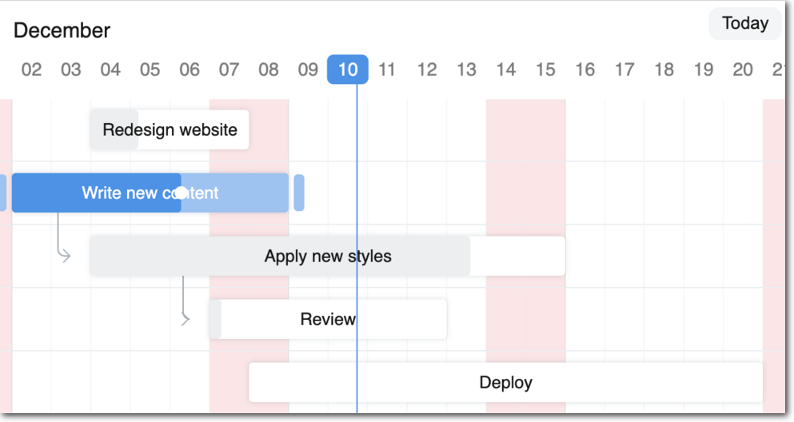

<div align="center" markdown="1">
    
    <h1>Frappe Gantt</h1>

**A modern, configurable, Gantt library for the web.**
</div>



## Frappe Gantt
Gantt charts are bar charts that visually illustrate a project's tasks, schedule, and dependencies. With Frappe Gantt, you can build beautiful, customizable, Gantt charts with ease.

You can use it anywhere from hobby projects to tracking the goals of your team at the worksplace.

[ERPNext](https://erpnext.com/) uses Frappe Gantt.


### Motivation
We needed a Gantt View for ERPNext. Surprisingly, we couldn't find a visually appealing Gantt library that was open source - so we decided to build it. Initially, the design was heavily inspired by Google Gantt and DHTMLX.


### Key Features
- **Customizable Views**: customize the timeline based on various time periods - day, hour, or year, you have it. You can also create your own views.
- **Ignore Periods**: exclude weekends and other holidays from your tasks' progress calculation.
- **Configure Anything**: spacing, edit access, labels, you can control it all. Change both the style and functionality to meet your needs.
- **Multi-lingual Support**: suitable for companies with an international base.

## Usage

Install with:
```bash
npm install frappe-gantt
```

Include it in your HTML:

```html
<script src="frappe-gantt.umd.js"></script>
<link rel="stylesheet" href="frappe-gantt.css">
```

Or from the CDN:
```html
<script src="https://cdn.jsdelivr.net/npm/frappe-gantt/dist/frappe-gantt.umd.js"></script>
<link rel="stylesheet" href="https://cdn.jsdelivr.net/npm/frappe-gantt/dist/frappe-gantt.css">
```

Start using Gantt:
```js
let tasks = [
  {
    id: '1',
    name: 'Redesign website',
    start: '2016-12-28',
    end: '2016-12-31',
    progress: 20
  },
  ...
]
let gantt = new Gantt("#gantt", tasks);
```

### Configuration
Frappe Gantt offers a wide range of options to customize your chart.


| **Option**               | **Description**                                                                 | **Possible Values**                                 | **Default**                        |
|---------------------------|---------------------------------------------------------------------------------|----------------------------------------------------|------------------------------------|
| `arrow_curve`            | Curve radius of arrows connecting dependencies.                                        | Any positive integer.                              | `5`                                |
| `auto_move_label`        | Move task labels when user scrolls horizontally.                                 | `true`, `false`                                    | `false`                            |
| `bar_corner_radius`      | Radius of the task bar corners (in pixels).                                         | Any positive integer.                              | `3`                                |
| `bar_height`             | Height of task bars (in pixels).                                                 | Any positive integer.                              | `30`                               |
| `container_height`       | Height of the container.                                                       | `auto` - dynamic container height to fit all tasks - _or_ any positive integer (for pixels).            | `auto`                           |
| `column_width`           | Width of each column in the timeline.                                          | Any positive integer.                  | 45                             |
| `date_format`            | Format for displaying dates.                                                   | Any valid JS date format string.                     | `YYYY-MM-DD`                     |
| `upper_header_height`    | Height of the upper header in the timeline (in pixels).                                     | Any positive integer.                              | `45`                               |
| `lower_header_height`    | Height of the lower header in the timeline (in pixels).                                     | Any positive integer.                              | `30`                               |
| `snap_at`                | Snap tasks at particular intervel while resizing or dragging.                                              | Any _interval_ (see below)                  | `1d`                             |
| `infinite_padding`       | Whether to extend timeline infinitely when user scrolls.                                   | `true`, `false`                                    | `true`                             |
| `holidays`               | Highlighted holidays on the timeline.                                           | Object mapping CSS colors to holiday types. Types can either be a) 'weekend', or b) array of _strings_ or _date objects_ or _objects_ in the format `{date: ..., label: ...}`          | `{ 'var(--g-weekend-highlight-color)': 'weekend' }` |
| `ignore`                 | Ignored areas in the rendering                  | `weekend` _or_ Array of strings or date objects (`weekend` can be present to the array also).                      | `[]`                               |
| `language`               | Language for localization.                                                     | ISO 639-1 codes like `en`, `fr`, `es`.            | `en`                             |
| `lines`                  | Determines which grid lines to display.                                   | `none` for no lines, `vertical` for only vertical lines, `horizontal` for only horizontal lines, `both` for complete grid.      | `both`                           |
| `move_dependencies`      | Whether moving a task automatically moves its dependencies.                                   | `true`, `false`                                    | `true`                             |
| `padding`                | Padding around task bars (in pixels).                                                | Any positive integer.                              | `18`                               |
| `popup_on`               | Event to trigger the popup display.                                             | `click` _or_ `hover`     | `click`                          |
| `readonly_progress`      | Disables editing task progress.                                                 | `true`, `false`                                    | `false`                            |
| `readonly_dates`         | Disables editing task dates.                                                    | `true`, `false`                                    | `false`                            |
| `readonly`               | Disables all editing features.                                                  | `true`, `false`                                    | `false`                            |
| `scroll_to`              | Determines the starting point when chart is rendered.                                           | `today`, `start`, `end`, or a date string.  | `today`                          |
| `show_expected_progress` | Shows expected progress for tasks.                                              | `true`, `false`                                    | `false`                            |
| `today_button`           | Adds a button to navigate to today’s date.                                      | `true`, `false`                                    | `true`                             |
| `view_mode`              | The initial view mode of the Gantt chart.                                          | `Day`, `Week`, `Month`, `Year`.           | `Day`                            |
| `view_mode_select`       | Allows selecting the view mode from a dropdown.                                 | `true`, `false`                                    | `false`                            |

Apart from these ones, two options - `popup` and `view_modes` (plural, not singular) - are available. They have "sub"-APIs, and thus are listed separately.

#### View Mode Configuration
The `view_modes` option determines all the available view modes for the chart. It should be an array of objects.

Each object can have the following properties:
- `name` (string) - the name of view mode.
- `padding` (interval) - the time above.
- `step` - the interval of each column
- `lower_text` (date format string _or_ function) - the format for text in lower header. Blank string for none. The function takes in `currentDate`, `previousDate`, and `lang`, and should return a string.
- `upper_text` (date format string _or_ function) - the format for text in upper header. Blank string for none. The function takes in `currentDate`, `previousDate`, and `lang`, and should return a string.
- `upper_text_frequency` (number) - how often the upper text has a value. Utilized in internal calculation to improve performance.
- `thick_line` (function) - takes in `currentDate`, returns Boolean determining whether the line for that date should be thicker than the others.

Three other options allow you to override general configuration for this view mode alone:
- `date_format`
- `column_width`
- `snap_at`
For details, see the above table.

#### Popup Configuration
`popup` is a function. If it returns
- `false`, there will be no popup.
- `undefined`, the popup will be rendered based on manipulation within the function
- a HTML string, the popup will be that string.

The function receives one object as an argument, containing:
- `task` - the task as an object
- `chart` - the entire Gantt chart
- `get_title`, `get_subtitle`, `get_details` (functions) - get the relevant section as a HTML node.
- `set_title`, `set_subtitle`, `set_details` (functions) - take in the HTML of the relevant section
- `add_action` (function) - accepts two parameters, `html` and `func` - respectively determining the HTML of the action and the callback when the action is pressed.

### API
Frappe Gantt exposes a few helpful methods for you to interact with the chart:

| **Name**               | **Description**                                                                 | **Parameters**                            |
|---------------------------|---------------------------------------------------------------------------------|------------------------------------------|
| `.update_options` | Re-renders the chart after updating specific options. | `new_options` - object containing new options. |
| `.change_view_mode` | Updates the view mode. | `view_mode` - Name of view mode _or_ view mode object (see above) and `maintain_pos` - whether to go back to current scroll position after rerendering, defaults to `false`. |
| `.scroll_current` | Scrolls to the current date | No parameters. |
| `.update_task` | Re-renders a specific task bar alone | `task_id` - id of task and `new_details` - object containing the task properties to be updated. |

## Development Setup
If you want to contribute enhancements or fixes:

1. Clone this repo.
2. `cd` into project directory.
3. Run `pnpm i` to install dependencies.
4. `pnpm run build` to build files - or `pnpm run build-dev` to build and watch for changes.
5. Open `index.html` in your browser.
6. Make your code changes and test them.

<br />
<br />
<div align="center" style="padding-top: 0.75rem;">
	<a href="https://frappe.io" target="_blank">
		<picture>
			<source media="(prefers-color-scheme: dark)" srcset="https://frappe.io/files/Frappe-white.png">
			
		</picture>
	</a>
</div>
