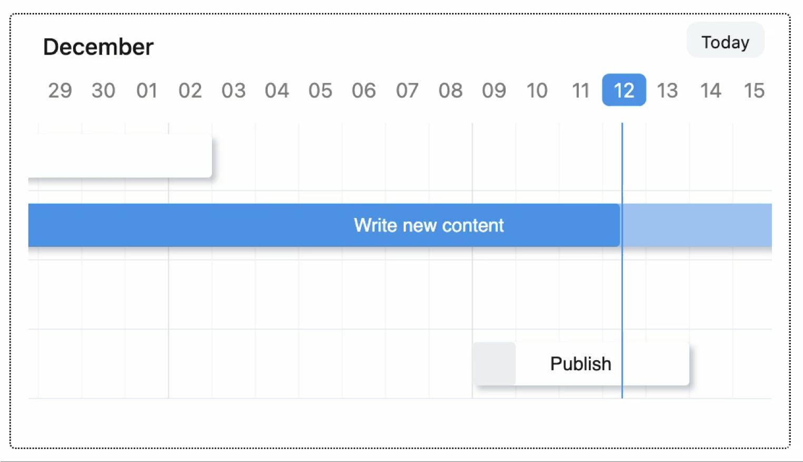

<div align="center" markdown="1">
    
    <h1>Frappe Gantt</h1>

**A modern, configurable, Gantt library for the web.**


    <br/>

</div>

<div align="center">
	
</div>

## About
Gantt charts are bar charts that visually illustrate a project's tasks, schedule, and dependencies. With Frappe Gantt, you can build beautiful, customizable, Gantt charts with ease.

You can use it anywhere from hobby projects to tracking the goals of your team at the worksplace.

[ERPNext](https://erpnext.com/) uses Frappe Gantt.


## Motivation
We needed a Gantt View for a project, but surprisingly couldn't find a visually appealing Gantt library that was open source. So we built it!

Initially, the design was heavily inspired by Google Gantt and DHTMLX.

Today, we pride ourselves on having the most aesthetically pleasing _and_ powerful Gantt library on the market - except, of course, that it's free.


## Key Features
A wide variety of modes - be it day, hour, or year, you have it. Or add your own modes!
- **Customizable Views**: customize the timeline based on various time periods - day, hour, or year, you have it. And if it's not covered, you can create your own!
- **Ignore Periods**: exclude weekends and other holidays from your tasks' progress calculation.
- **Configure Anything**: spacing, edit access, labels, you can control it all. Change both the style and functionality to meet your needs.
- **Multi-lingual Support**: suitable for companies with an international base.

### Usage

Install with:
```bash
npm install frappe-gantt
```

Include it in your HTML:

```html
<script src="frappe-gantt.umd.js"></script>
<link rel="stylesheet" href="frappe-gantt.css">
```

Or from the CDN:
```html
<script src="https://cdn.jsdelivr.net/npm/frappe-gantt/dist/frappe-gantt.umd.js"></script>
<link rel="stylesheet" href="https://cdn.jsdelivr.net/npm/frappe-gantt/dist/frappe-gantt.css">
```

And start hacking:
```js
let tasks = [
  {
    id: '1',
    name: 'Redesign website',
    start: '2016-12-28',
    end: '2016-12-31',
    progress: 20
  },
  ...
]
let gantt = new Gantt("#gantt", tasks);
```

To see the list of all options, check out [the docs](docs.frappe.io/gantt) (under development).

## Development Setup
If you want to contribute enhancements or fixes:

1. Clone this repo.
2. `cd` into project directory.
3. Run `pnpm i` to install dependencies.
4. `pnpm run build` to build files - or `pnpm run build-dev` to build and watch for changes.
5. Open `index.html` in your browser.
6. Make your code changes and test them.

<h2></h2>
<div align="center" style="padding-top: 0.75rem;">
	<a href="https://frappe.io" target="_blank">
		<picture>
			<source media="(prefers-color-scheme: dark)" srcset="https://frappe.io/files/Frappe-white.png">
			
		</picture>
	</a>
</div>
